<div align="center" style="position: relative;">

<h1 style="margin-bottom: 0.2em;">Ray Tracing Challenge in Rust</h1>

<a href="https://github.com/nishantb06/ray_tracing_challenge_rs/actions/workflows/rust-tests.yml" style="position: absolute; top: 0.5em; right: 10.2em;">
  
</a>

<a href="https://github.com/rust-lang/rust" style="position: absolute; top: 0.5em; right: 1.2em;">
  
</a>

<p><strong>Rust implementation of <em>The Ray Tracer Challenge</em> by Jamis Buck, built from first principles:
tuples, matrices, transformations, rays, intersections, materials, lights, patterns, reflections,
refractions, and multi-object worlds.</strong></p>

</div>

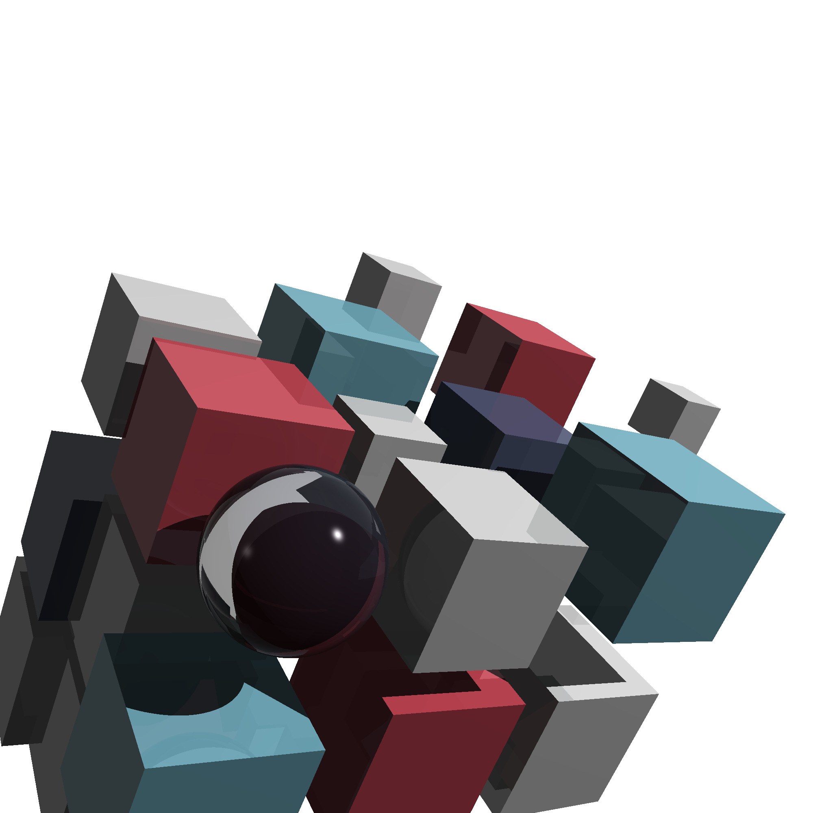

## Why this project is worth checking out

- Built without a graphics engine: core ray tracing math and rendering pipeline are implemented directly in Rust.
- Progresses from fundamentals to full scenes: starts with simple primitives and ends with complex compositions.
- Supports physically inspired effects: shadows, reflections, transparency, and refraction.
- Includes a rich scene gallery: 25+ binary examples under `src/bin/` for experimenting with materials and patterns.
- Keeps code modular: rendering primitives and math utilities are separated into reusable modules.

## Implemented features

- **Math core**: tuples/vectors, matrices, transformations, view transforms.
- **Geometry**: sphere, plane, cube.
- **Ray logic**: ray-object intersections, hit computation, world intersection management.
- **Shading model**: Phong lighting (ambient, diffuse, specular), shadows.
- **Materials**: reflectivity, transparency, refractive index.
- **Patterns**: stripe, gradient, ring, checker (with object and pattern transforms).
- **Camera + rendering**: ray generation per pixel and full scene render to PPM.

## Quick start

### 1) Build

```bash
cargo build
```

### 2) Render a scene

Pick any binary from `src/bin/`. For example:

```bash
cargo run --bin cover_scene
```

This writes a PPM file (for `cover_scene`, output is `media/images_ppm/cover_scene.ppm`).

### 3) Convert PPM to PNG

```bash
cargo run --bin ppm_to_png -- media/images_ppm/cover_scene.ppm media/images/cover_scene.png
```

## Scene gallery

| Scene | Preview |
| --- | --- |
| Cover scene |  |
| Single glass sphere | 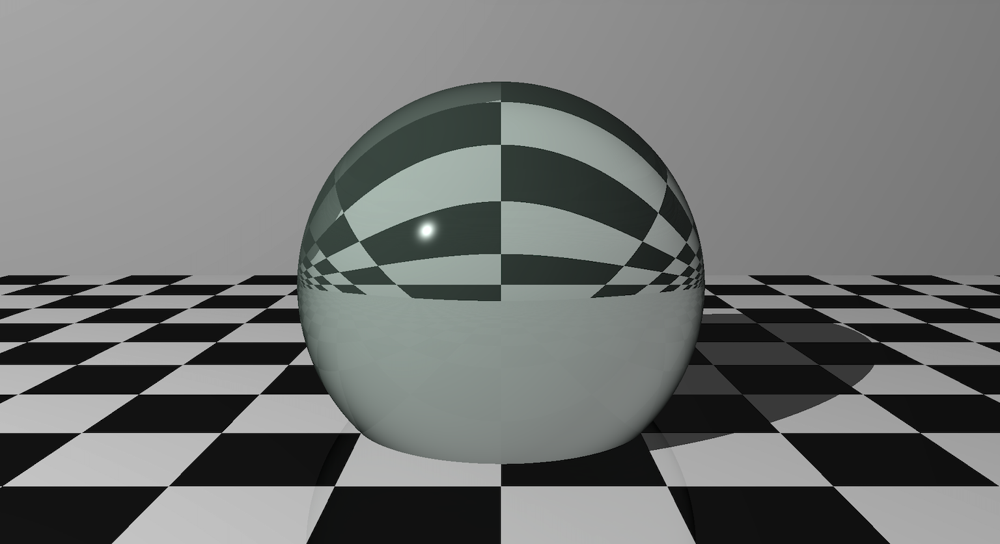 |
| Reflective floor | 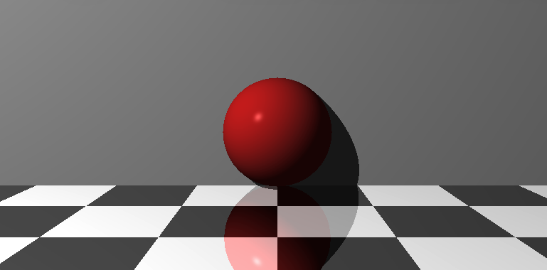 |
| Pattern scene | 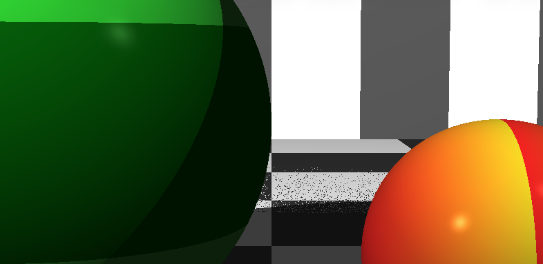 |
| Checker sphere | 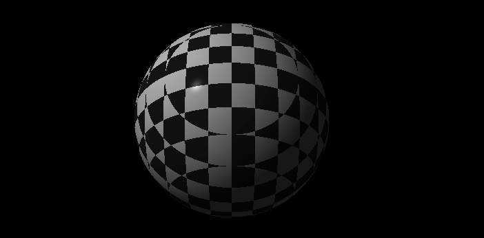 |
| Checker plane | 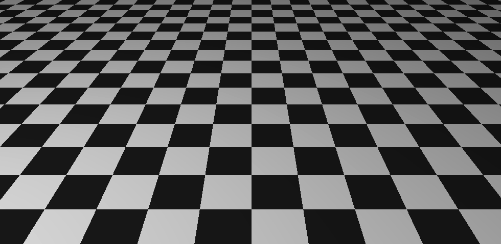 |
| Wall backdrop | 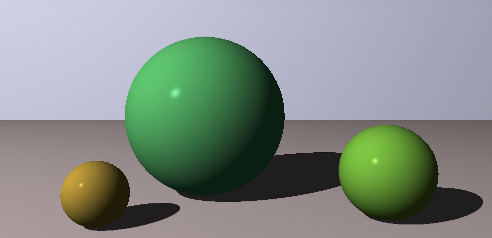 |
| Ceiling | 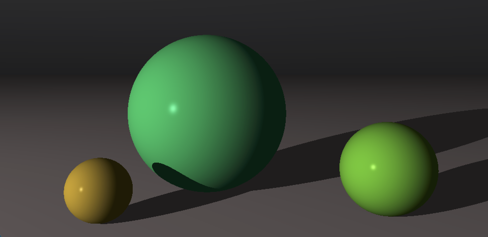 |
| Embedded sphere | 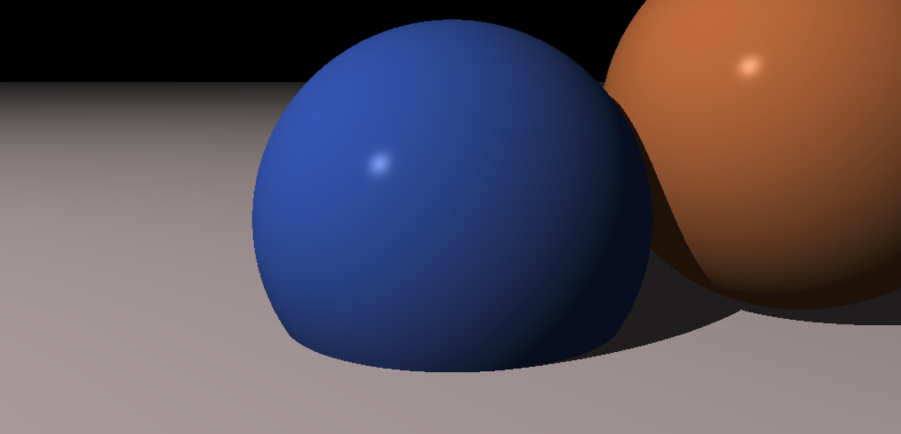 |
| Cone and Cylinder | 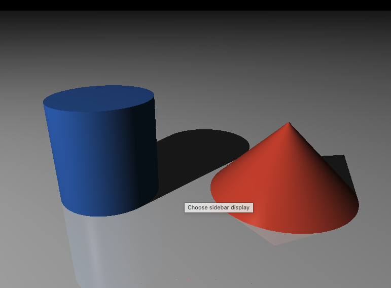 |
| Hexagon rendered with Groups| 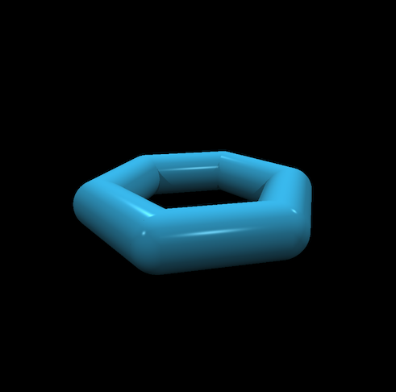 |
| Dodecahedron, rendered with triangles | 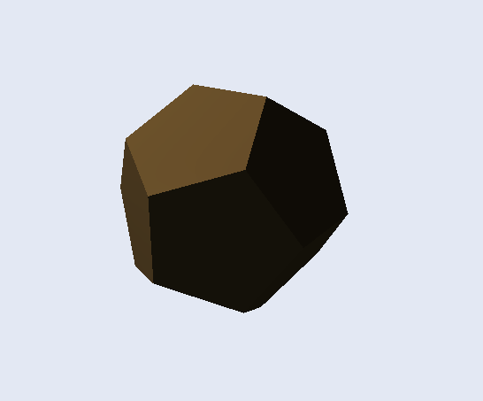 |
| Football (truncated icosahedron) | 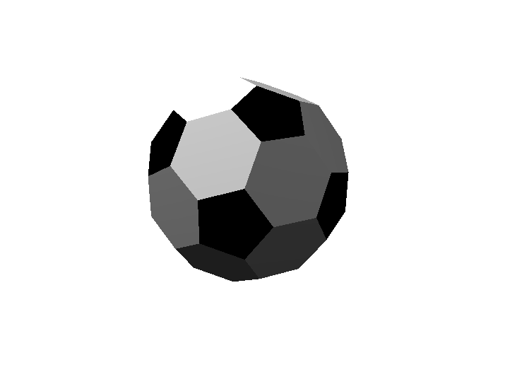 |
| Football (truncated icosahedron + Smooth triangles) | 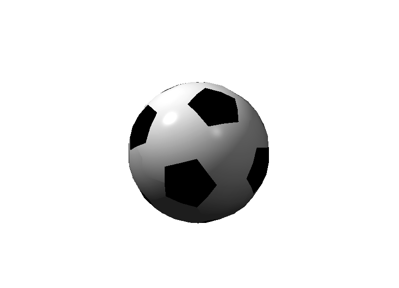 |
| Teopot (parse and render any .obj file) | 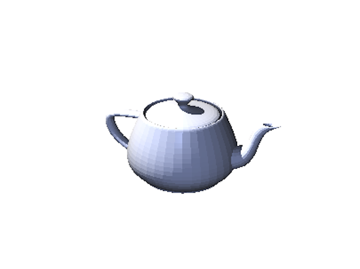 |
| Cottage (https://free3d.com/3d-model/abandoned-cottage-house-825251.html) | 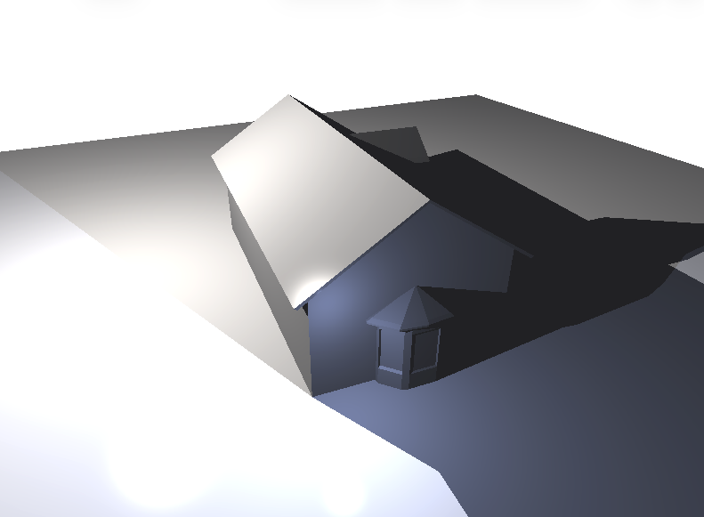 |
| Dice (CSG) | 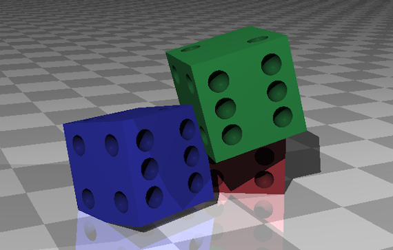 |

Additional renders are available in `media/images/`.

## Project structure

```text
src/                  # Core ray tracer library + scene CLI bins
live_server/          # Progressive-render WebSocket backend
live_viewer/          # egui frontend that paints streaming pixels
```

```text
src/
  lib.rs              # Library exports
  tuple.rs            # Points, vectors, vector ops
  matrix.rs           # Matrix math and inversion
  transformation.rs   # Translation, scaling, rotation, view transforms
  ray.rs              # Rays and ray transforms
  intersection.rs     # Intersections and hit logic
  material.rs         # Material properties
  light.rs            # Point lights
  pattern.rs          # Procedural patterns
  sphere.rs
  plane.rs
  cube.rs
  world.rs            # Scene graph + shading pipeline
  camera.rs           # Camera model + rendering (+ progressive stream API)
  canvas.rs           # Pixel buffer + PPM export
  bin/                # Scene entrypoints (25+ examples)
```

## Live progressive rendering

Watch pixels fill in over a WebSocket while the tracer runs (Rust egui viewer, or any TypeScript/HTML canvas client).

```bash
# Terminal 1 — backend (group-hexagon demo at 400x400)
cargo run -p live_server

# Terminal 2 — egui viewer (scanline / sequential by default)
cargo run -p live_viewer

# Parallel fill (pixels arrive in completion order, not scan order)
cargo run -p live_viewer -- parallel
```

Protocol (JSON): client sends `{ "type": "Start", "scene"?: "...", "width"?: N, "height"?: N, "mode": "sequential"|"parallel", "batch_size"?: N }`; server replies with `FrameStart`, batched `Pixels` (`r`/`g`/`b` as 0-255), then `FrameDone`. A TypeScript client can use the same messages with `<canvas>` + `ImageData` — no raytracer changes required.

The web UI includes a **scene dropdown** (from `GET /scenes`) and a **size dropdown** (from `GET /resolutions`): `400×400` (default), `300×400`, `1200×800`, `1920×1280`, and `3840×2160` (4K). 4K streams ~8.3M pixels over JSON and will be slow — prefer parallel mode. Available scenes: `group_hexagon`, `cover_scene`, `football`, `single_glass_sphere`, `reflective_floor`. Shared builders live in `src/scenes/` and are also used by the matching CLI bins.

### Web client (TypeScript + Vite)

```bash
# one-time
cd live_server/web && npm install

# HMR dev (Vite :5173 proxies /ws to the Rust server :3030)
# Terminal 1: cargo run -p live_server
# Terminal 2:
npm run dev
# open http://localhost:5173

# or production-style (same origin for page + /ws):
npm run build && cargo run -p live_server   # open http://localhost:3030
```

The same `live_server` binary serves the built page (`live_server/static/`) and the WebSocket (`/ws`). Typed protocol mirrors live in `live_server/web/src/protocol.ts`; keep them in sync with `live_server/src/protocol.rs`.

### Deploy

A `Dockerfile` (multi-stage: Node frontend build → Rust build → slim runtime) is included. Deploy to any platform that builds a Dockerfile and terminates TLS:

```bash
docker build -t ray-tracer-live .
docker run -p 3030:3030 -e PORT=3030 ray-tracer-live
```

- **Fly.io:** `fly launch --no-deploy && fly deploy && fly apps open`
- **Railway:** `railway up`
- **Render:** connect repo, Runtime = Docker

The app binds to `0.0.0.0:$PORT` (`PORT` defaults to 3030; `STATIC_DIR` defaults to `live_server/static/`). Behind a TLS-terminating proxy the browser uses `wss://`, which the proxy downgrades to plain `ws://` internally — no TLS code in the app.

## Notable scene entrypoints

- `cover_scene`
- `single_glass_sphere`
- `reflective_floor`
- `pattern_scene`
- `complex_cube`
- `hexagonal_room`
- `solar_system`

## Tech stack

- Rust Edition 2024
- Workspace crates: `ray_tracing_challenge_rs`, `live_server`, `live_viewer`
- Dependencies: [`image`](https://crates.io/crates/image) for image conversion; [`rayon`](https://crates.io/crates/rayon) for parallel pixel render; [`crossbeam-channel`](https://crates.io/crates/crossbeam-channel) for progressive streaming

## Reference

- Book: [The Ray Tracer Challenge](https://pragprog.com/titles/jbtracer/the-ray-tracer-challenge/)
