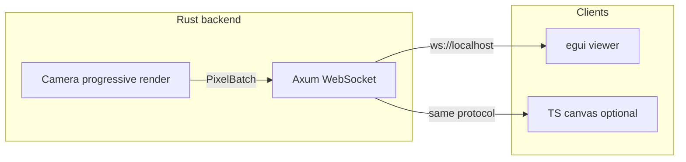

# Live progressive pixel rendering

## Feasibility

**Yes.** [`Camera::render`](src/camera.rs) already computes each pixel independently:

```74:89:src/camera.rs
pub fn render(&self, world: &World) -> Canvas {
    // ...
    image.pixels_mut().par_iter_mut().zip(coordinates.par_iter())
        .for_each(|(pixel, &(x, y))| {
            let ray = self.ray_for_pixel(x as f64, y as f64);
            *pixel = color_at(world, &ray, MAX_RECURSION_DEPTH);
        });
}
```

Nothing in that loop requires waiting for a full canvas. You can emit `(x, y, color)` as each pixel finishes. Existing `color_at` / `World` / shapes stay unchanged.

| Mode | Behavior | What you see |
|------|----------|--------------|
| **Sequential** | Single-threaded scanline (`for y { for x { ... } }`) | True left-to-right, top-to-bottom "one by one" |
| **Parallel** | Keep rayon; send results via a channel as workers finish | Multiple pixels update at once, **not** scan order |

`batch_size` is a **parameter** that applies to either mode (pack N pixels per WS message), not a separate mode. Literal 1-message-per-pixel is possible but slow at high res (e.g. 800x600 = 480k frames). Default: sequential or parallel compute, **batched WS** (e.g. 64-256 pixels per message). Optional `batch_size: 1` for tiny canvases if you want ultra-literal updates.

> **Watch-out for the parallel demo:** `World::default_world()` at 200x150 across 8 cores renders in **milliseconds** — you won't see progressive fill, just a complete frame. For a visually interesting parallel demo use a heavier scene (teapot / cover_scene / group_hexagon) or a larger resolution (e.g. 800x600+). Sequential at 200x150 will be watchable; parallel won't unless the scene is slow.

**TypeScript:** Yes. Same JSON (or binary) message shape; draw with `canvas` + `ImageData` / `putImageData`. No change to the ray tracer — only the client swaps.



> **Alternative (not chosen for v1):** a native egui viewer could call `Camera::render_progressive` **directly in-process** (no server, no WS, no JSON) by sharing an `Arc<Mutex<Vec<u8>>>` + `request_repaint()`. This drops ~half the work for the native-only path. We keep the WS architecture so the same protocol serves both egui and TS clients, at the cost of one extra process for the native viewer.

## Architecture (chosen defaults)

### Workspace layout — yes, this becomes a Cargo workspace

The repo will switch from a single package to a **3-member workspace** so heavy UI/server deps never load into the core raytracer or slow `cargo test` on the library:

```
ray_tracing_challenge_rs/          # workspace root
  Cargo.toml                       # [workspace] members = [".", "live_server", "live_viewer"]
  src/                             # existing library + scene bins (unchanged role)
  live_server/                     # NEW crate — backend
    Cargo.toml                     # deps: ray_tracing_challenge_rs, axum, tokio, serde, ...
    src/main.rs                    # protocol types live here
  live_viewer/                     # NEW crate — frontend
    Cargo.toml                     # deps: eframe/egui, tokio-tungstenite, serde — NOT the raytracer
    src/main.rs                    # mirrors the protocol types
```

| Crate | Role | Depends on raytracer lib? |
|-------|------|---------------------------|
| `.` (`ray_tracing_challenge_rs`) | Core lib + existing `src/bin/*` scene CLIs | — |
| `live_server` | Axum WebSocket; progressive render; demo scene; protocol types | **Yes** |
| `live_viewer` | egui window; paints pixel batches from WS; mirrors protocol types | **No** (protocol only) |

Shared WS message types (`FrameStart`, `Pixels`, `FrameDone`) are defined in `live_server` and mirrored in `live_viewer` (same JSON shape). A fourth shared `live_protocol` crate is unnecessary for v1 — promote later if duplication becomes noisy.

**Why not bins inside the existing package?** Putting `eframe`/`axum` on the root crate (even as optional features) still couples the challenge library to GUI/server tooling and complicates CI. Separate crates keep the book-implementation crate clean.

### Minimal core library change

The **only** edit to `src/` is adding `render_progressive` to `src/camera.rs` plus a tiny `PixelUpdate`/`RenderMode`. Specifically:

- **No** serde derives on `Color` / `Canvas` (they stay plain).
- **No** new heavyweight dependencies on the root crate. `crossbeam-channel` is the one small addition (needed so `&Sender` is `Sync` and shareable across rayon workers without per-task clones).
- **No** changes to `World`, `color_at`, shapes, or existing `render()`.

All protocol/serialization concerns live in the workspace crates, which convert `Color` → wire bytes themselves.

## Library API

```rust
use crossbeam_channel::Sender;

pub struct PixelUpdate { pub x: usize, pub y: usize, pub color: Color }

pub enum RenderMode { Sequential, Parallel }

impl Camera {
    /// Emit each computed pixel into `tx`. Caller owns batching/transport.
    /// The existing `render()` is unchanged and remains the CLI/bench path.
    pub fn render_progressive(
        &self,
        world: &World,
        mode: RenderMode,
        tx: &Sender<PixelUpdate>,
    ) {
        match mode {
            RenderMode::Sequential => {
                for y in 0..self.vsize {
                    for x in 0..self.hsize {
                        let ray = self.ray_for_pixel(x as f64, y as f64);
                        let color = color_at(world, &ray, MAX_RECURSION_DEPTH);
                        let _ = tx.send(PixelUpdate { x, y, color });
                    }
                }
            }
            RenderMode::Parallel => {
                let coordinates: Vec<(usize, usize)> = (0..self.vsize)
                    .flat_map(|y| (0..self.hsize).map(move |x| (x, y)))
                    .collect();
                coordinates.par_iter().for_each(|&(x, y)| {
                    let ray = self.ray_for_pixel(x as f64, y as f64);
                    let color = color_at(world, &ray, MAX_RECURSION_DEPTH);
                    let _ = tx.send(PixelUpdate { x, y, color });
                });
            }
        }
    }
}
```

- **Why `crossbeam_channel::Sender` (chosen):** its `Sender` is `Sync`, so `&tx` is shared directly across rayon workers — zero per-pixel clone. `std::sync::mpsc::Sender` is **not** `Sync`, which would force either a clone-per-task or an `Fn + Send + Sync` closure wrapper. `crossbeam-channel` is a tiny, widely-used dep and is the only addition to the core crate.
- **Batching is the caller's job** (the server), keeping the library dead simple. The library emits one `PixelUpdate` per pixel; the server drains the channel and packs N into a WS frame.
- **No `Canvas` is allocated** in the progressive path — the server/viewer owns the buffer.
- Do **not** change [`World`](src/world.rs); the backend only calls `ray_for_pixel` + `color_at` the same way `render` does today.

## WebSocket protocol

Minimal JSON (easy for both Rust and TS):

1. Server → client `FrameStart { width, height }` — sent **synchronously before** spawning rayon, so no pixels race ahead of it.
2. Server → client `Pixels { pixels: [{ x, y, r, g, b }, ...] }` — r/g/b as `u8` in 0..255 (clamped the same way `Canvas::scale_component` does, `src/canvas.rs:102`). Pick 0..255 (not 0..1) so TS `ImageData` is direct.
3. Server → client `FrameDone`

Client → server: `Start { mode: "sequential" | "parallel", batch_size?: number }` (optional; can auto-start on connect for v1).

> **Binary is a v2 option, not a TS constraint.** Browser WebSocket handles `ArrayBuffer` natively; a packed binary protocol (`[u16 x, u16 y, u8 r, u8 g, u8 b]` per pixel, or a tile rect + RGBA run) is ~5-10x smaller/faster than JSON for 480k pixels. JSON is chosen for v1 simplicity; the protocol is the only thing that changes to upgrade.

> **Backpressure:** if a viewer is slower than a parallel renderer, WS buffers grow unbounded. Fine for v1. If needed later, use a bounded channel + `try_send` and drop/flag late frames.
>
> **Multi-client:** Axum's `broadcast` channel is barely more code than per-connection and gives you egui + TS at once for free. Consider for v1+.

## Frontend (egui)

- Open WS on startup to `ws://127.0.0.1:3030/ws` (or similar).
- Allocate `Vec<u8>` of size `width * height * 4`, initially black.
- On each `Pixels` message, write RGBA and `request_repaint()`.
- Show a simple progress label (`done / total`).

## TypeScript alternative (same backend)

A ~50-line client: `new WebSocket(...)`, `JSON.parse`, draw into `<canvas>` via `ImageData`. No Rust UI required if you only want a browser view later. **Backend stays the same.**

## Out of scope for v1

- Choosing among all 25+ scene bins from the UI (hardcode one scene; wire scene picker later).
- Saving PPM from the live path (existing CLI bins already do that).
- Changing rayon usage inside the normal `render()` path.
- Binary WS protocol (JSON for v1; binary later).
- A shared `live_protocol` crate (mirror types for now).

## Verification

1. `cargo run -p live_server` then `cargo run -p live_viewer`.
2. Sequential mode: image fills in scanline order.
3. Parallel mode: speckled / random fill, still completes to a correct image (use a heavy enough scene that fill is visible — see watch-out above).
4. `cargo test` in the root crate still runs clean and fast (only `crossbeam-channel` added to the library).
5. Optional: a tiny HTML/TS page against the same WS to confirm cross-language compatibility.
