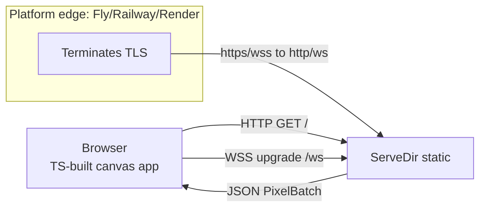

# Live website deployment plan

## Recommendation: TS/HTML canvas path (Option 2)

`live_server` already speaks browser-friendly JSON over WebSocket with `CorsLayer::permissive` enabled. The backend barely changes — we (a) serve the built static site from the same server, and (b) bind to `0.0.0.0` + `$PORT`. The native `live_viewer` (eframe) stays for local dev; the website is additive.

**Frontend stack:** TypeScript + [Vite](https://vitejs.dev/). Vite gives HMR during dev (`npm run dev` on :5173 proxying `/ws` to the Rust server on :3030) and a clean `npm run build` that emits plain static files into `live_server/static/` for `ServeDir` to serve in production. No runtime framework — just typed DOM + Canvas, ~80 lines.

**Why not egui-WASM:** works, but heavier (twin crate, `web_sys`/`ewebsock`, trunk, single-threaded async, debug pain). The canvas path gives the same visual result in an afternoon and deploys as static files.



> **Key deployment fact:** browsers require `wss://` when the page is over `https://`. Every platform below **terminates TLS at the edge** and forwards plain `ws://` to your app on its internal port. Your Rust code never touches TLS — the frontend just derives the scheme from `window.location`.

---

## New layout

```
live_server/
  Cargo.toml
  src/ (main.rs, protocol.rs, scene.rs — scene/protocol unchanged)
  web/                  # NEW — Vite + TS project (source)
    package.json
    tsconfig.json
    vite.config.ts
    index.html
    src/
      app.ts
      protocol.ts       # typed mirrors of live_server/src/protocol.rs
      style.css
  static/               # NEW — Vite build OUTPUT (gitignored; built before run/deploy)
    index.html
    assets/...
```

`live_server/web/` holds source. `live_server/static/` is generated by `npm run build` and served by `ServeDir`. Add `live_server/static/` and `live_server/web/node_modules/` to `.gitignore`.

---

## Step 1 — Backend changes (3 small edits to `live_server`)

### 1a. `live_server/Cargo.toml` — add the `fs` feature to `tower-http`

```toml
# change:
tower-http = { version = "0.6", features = ["cors"] }
# to:
tower-http = { version = "0.6", features = ["cors", "fs"] }
```

(`axum = { version = "0.8", features = ["ws"] }` and `tokio = { features = ["full"] }` already cover everything else. No new Rust crates.)

### 1b. `live_server/src/main.rs` — serve static, bind `$PORT`/`0.0.0.0`, add `/health`

Replace `main()` and the imports block with:

```rust
use axum::{
    extract::ws::{Message, WebSocket, WebSocketUpgrade},
    response::IntoResponse,
    routing::get,
    Router,
};
use crossbeam_channel::unbounded;
use futures_util::StreamExt;
use protocol::{ClientMessage, PixelWire, RenderModeWire, ServerMessage};
use ray_tracing_challenge_rs::camera::{PixelUpdate, RenderMode};
use std::net::SocketAddr;
use tower_http::{cors::CorsLayer, services::ServeDir};

/// Baked-in dev path (lives next to live_server/Cargo.toml). Overridable via env for Docker.
const DEFAULT_STATIC_DIR: &str = concat!(env!("CARGO_MANIFEST_DIR"), "/static");

#[tokio::main]
async fn main() {
    let static_dir = std::env::var("STATIC_DIR").unwrap_or_else(|_| DEFAULT_STATIC_DIR.into());

    let app = Router::new()
        .route("/ws", get(ws_handler))
        .route("/health", get(|| async { "ok" }))
        .fallback_service(ServeDir::new(&static_dir))
        .layer(CorsLayer::permissive());

    let port: u16 = std::env::var("PORT").ok().and_then(|s| s.parse().ok()).unwrap_or(3030);
    let host = std::env::var("HOST")
        .ok()
        .and_then(|s| s.parse().ok())
        .unwrap_or(std::net::Ipv4Addr::UNSPECIFIED); // 0.0.0.0
    let addr = SocketAddr::new(host, port);

    println!("live_server listening on http://{addr}");
    println!("  static:  {static_dir}");
    println!("  ws:      ws://{addr}/ws  (wss:// behind a TLS-terminating proxy)");

    let listener = tokio::net::TcpListener::bind(addr).await.expect("bind failed");
    axum::serve(listener, app).await.expect("server error");
}
```

The rest of `main.rs` (`ws_handler`, `handle_socket`, `wait_for_start`, `send_json`, `scale_component`, `to_wire`) is **unchanged**. The `/ws` protocol, batching, and `render_progressive` call stay exactly as they are.

> **Single-binary alternative (optional, later):** swap `ServeDir` for [`rust-embed`](https://crates.io/crates/rust-embed) to bake `static/` into the binary — then there's no `STATIC_DIR`/path concern at all. Start with `ServeDir` since you already depend on `tower-http`; promote if you want a one-file deploy.

### 1c. `.gitignore` additions (repo root)

```
live_server/static/
live_server/web/node_modules/
```

---

## Step 2 — The TypeScript frontend (`live_server/web/`)

### `live_server/web/package.json`

```json
{
  "name": "live-web",
  "private": true,
  "type": "module",
  "scripts": {
    "dev": "vite",
    "build": "tsc && vite build",
    "preview": "vite preview"
  },
  "devDependencies": {
    "typescript": "^5.6",
    "vite": "^5.4"
  }
}
```

### `live_server/web/tsconfig.json`

```json
{
  "compilerOptions": {
    "target": "ES2022",
    "module": "ESNext",
    "moduleResolution": "Bundler",
    "strict": true,
    "noUnusedLocals": true,
    "noUnusedParameters": true,
    "skipLibCheck": true,
    "isolatedModules": true,
    "verbatimModuleSyntax": true
  },
  "include": ["src"]
}
```

### `live_server/web/vite.config.ts`

```ts
import { defineConfig } from "vite";

export default defineConfig({
  // Dev: proxy /ws to the Rust backend so the browser page and WS share an origin.
  server: {
    proxy: { "/ws": { target: "ws://localhost:3030", ws: true } },
  },
  // Build: emit next to the Rust crate so ServeDir finds it.
  build: { outDir: "../static", emptyOutDir: true },
});
```

### `live_server/web/index.html` (Vite entry)

```html
<!doctype html>
<html lang="en">
  <head>
    <meta charset="utf-8" />
    <meta name="viewport" content="width=device-width, initial-scale=1" />
    <title>Ray tracer — live</title>
    <link rel="stylesheet" href="/src/style.css" />
  </head>
  <body>
    <main>
      <h1>Live ray tracer</h1>
      <div class="controls">
        <label>Mode
          <select id="mode">
            <option value="sequential" selected>Sequential (scanline)</option>
            <option value="parallel">Parallel (speckled)</option>
          </select>
        </label>
        <button id="start">Render</button>
      </div>
      <div class="status"><span id="status">Idle</span></div>
      <progress id="bar" max="1" value="0"></progress>
      <div id="frac"></div>
      <canvas id="canvas" width="400" height="400"></canvas>
    </main>
    <script type="module" src="/src/app.ts"></script>
  </body>
</html>
```

### `live_server/web/src/protocol.ts` — typed mirrors of `live_server/src/protocol.rs`

```ts
export type RenderMode = "sequential" | "parallel";

export interface PixelWire {
  x: number; y: number;
  r: number; g: number; b: number; // u8 0..255
}

export type ServerMessage =
  | { type: "FrameStart"; width: number; height: number }
  | { type: "Pixels"; pixels: PixelWire[] }
  | { type: "FrameDone" };

export interface ClientStart {
  type: "Start";
  mode: RenderMode;
  batch_size?: number;
}
```

### `live_server/web/src/app.ts`

```ts
import type { ClientStart, PixelWire, RenderMode, ServerMessage } from "./protocol";

const canvas  = document.getElementById("canvas") as HTMLCanvasElement;
const ctx     = canvas.getContext("2d")!;
const status  = document.getElementById("status") as HTMLSpanElement;
const bar     = document.getElementById("bar") as HTMLProgressElement;
const frac    = document.getElementById("frac") as HTMLDivElement;
const startBt = document.getElementById("start") as HTMLButtonElement;
const modeSel = document.getElementById("mode") as HTMLSelectElement;

let ws: WebSocket | null = null;
let width = 0, height = 0, img: ImageData | null = null, done = 0, total = 0;

// Derive ws/wss from the page URL so it works on localhost AND in production.
function wsUrl(): string {
  const proto = location.protocol === "https:" ? "wss:" : "ws:";
  return `${proto}//${location.host}/ws`;
}

function setStatus(s: string): void { status.textContent = s; }

function updateProgress(): void {
  if (total > 0) {
    const f = done / total;
    bar.value = f;
    frac.textContent = `${done} / ${total} (${(f * 100).toFixed(1)}%)`;
  }
}

function render(): void {
  if (ws) ws.close();
  setStatus("Connecting…");
  ws = new WebSocket(wsUrl());

  ws.onopen = () => {
    setStatus("Connected — rendering…");
    const msg: ClientStart = { type: "Start", mode: modeSel.value as RenderMode, batch_size: 128 };
    ws!.send(JSON.stringify(msg));
  };

  ws.onmessage = (ev: MessageEvent) => {
    const msg = JSON.parse(ev.data) as ServerMessage;
    switch (msg.type) {
      case "FrameStart":
        width = msg.width; height = msg.height;
        canvas.width = width; canvas.height = height;
        img = ctx.createImageData(width, height);
        done = 0; total = width * height;
        break;
      case "Pixels":
        if (!img) break;
        for (const p of msg.pixels) writePixel(img, p, width);
        ctx.putImageData(img, 0, 0);
        break;
      case "FrameDone":
        setStatus("Done");
        break;
    }
    updateProgress();
  };

  ws.onerror  = () => setStatus("Connection error");
  ws.onclose  = () => { if (status.textContent !== "Done") setStatus("Disconnected"); };
}

function writePixel(img: ImageData, p: PixelWire, w: number): void {
  const i = (p.y * w + p.x) * 4;
  img.data[i]     = p.r;
  img.data[i + 1] = p.g;
  img.data[i + 2] = p.b;
  img.data[i + 3] = 255;
}

startBt.addEventListener("click", render);
```

### `live_server/web/src/style.css`

```css
:root { color-scheme: dark; }
body { margin: 0; font: 14px/1.5 system-ui, sans-serif; background: #111; color: #eee; }
main { max-width: 640px; margin: 2rem auto; padding: 0 1rem; }
h1 { margin: 0 0 1rem; }
.controls { display: flex; gap: .75rem; align-items: end; margin-bottom: 1rem; }
button, select { background: #222; color: #eee; border: 1px solid #444; border-radius: 4px; padding: .35rem .6rem; }
button { cursor: pointer; }
.status { color: #8ab4f8; margin-bottom: .25rem; }
#bar { width: 100%; height: 6px; }
#frac { font-size: 12px; color: #999; margin: .25rem 0 1rem; }
canvas { width: 100%; height: auto; image-rendering: pixelated; border: 1px solid #333; background: #000; }
```

### Install + build commands

```bash
cd live_server/web
npm install          # one-time
npm run build        # tsc type-checks, vite emits -> live_server/static/
```

---

## Step 3 — Dev workflow (two modes)

**Mode A — HMR dev (best while editing the frontend):**

```bash
# Terminal 1
cargo run -p live_server
# Terminal 2
cd live_server/web && npm run dev
# open http://localhost:5173  (Vite proxies /ws -> :3030)
```

**Mode B — production-style (what you'll ship):**

```bash
cd live_server/web && npm run build
cargo run -p live_server
# open http://localhost:3030  (ServeDir serves the built static/, same origin as /ws)
```

---

## Step 4 — `Dockerfile` + `.dockerignore` (platform-agnostic)

The Dockerfile adds a Node stage to build the frontend, then a Rust stage, then a slim runtime. The result is a single image that any platform can build and run.

### `Dockerfile` (repo root)

```dockerfile
# --- 1. frontend build ---
FROM node:20-bookworm AS web
WORKDIR /build/web
COPY live_server/web/package*.json ./
RUN npm ci
COPY live_server/web ./
RUN npm run build          # -> /build/static

# --- 2. rust build ---
FROM rust:1-bookworm AS builder
WORKDIR /build
COPY . .
RUN cargo build --release -p live_server

# --- 3. runtime ---
FROM debian:bookworm-slim
RUN apt-get update && apt-get install -y --no-install-recommends ca-certificates \
 && rm -rf /var/lib/apt/lists/*
WORKDIR /app
COPY --from=builder /build/target/release/live_server /app/live_server
COPY --from=web     /build/static                   /app/static
ENV STATIC_DIR=/app/static
ENV HOST=0.0.0.0
ENV PORT=3030
EXPOSE 3030
CMD ["/app/live_server"]
```

### `.dockerignore` (repo root)

```
target
media
.git
.cursor
.DS_Store
*.md
plans
wiki
live_server/web/node_modules
live_server/static
```

### Local Docker test

```bash
docker build -t ray-tracer-live .
docker run -p 3030:3030 -e PORT=3030 ray-tracer-live
# open http://localhost:3030
```

---

## Step 5 — Deploy (Dockerfile-first; pick any platform)

All three platforms build your `Dockerfile` and terminate TLS at the edge. The app just needs to bind to `0.0.0.0:$PORT` (it does), and they auto-inject `PORT`. No platform-specific config required.

### Fly.io

```bash
brew install flyctl && fly auth login
fly launch --no-deploy     # writes fly.toml from the Dockerfile
fly deploy
fly apps open
```

Optional `fly.toml` pinning (generated, but verify):
```toml
[http_service]
  internal_port = 3030
  force_https = true
  auto_stop_machines = true
  auto_start_machines = true
[[http_service.checks]]
  interval = "30s"
  timeout = "5s"
  path = "/health"
```

### Railway

```bash
brew install railway && railway login
railway init
railway up                # detects Dockerfile, builds, deploys
railway domain            # prints https://<your-app>.up.railway.app
```

### Render

1. Push to GitHub. 2. New → Web Service → connect repo. 3. Runtime = **Docker**. 4. Deploy. TLS automatic on `*.onrender.com`. Render auto-sets `PORT`.

In all three: the browser loads the page over `https://` and connects via `wss://`; the platform's proxy downgrades to plain `ws://` on your internal port. **No TLS code in the app.**

---

## Step 6 — README additions

Append to the existing "Live progressive rendering" section in `README.md`:

````markdown
### Web client (TypeScript + Vite)

```bash
# one-time
cd live_server/web && npm install

# HMR dev (Vite :5173 proxies /ws to the Rust server :3030)
npm run dev
# or production-style:
npm run build && cargo run -p live_server   # open http://localhost:3030
```

The same `live_server` binary serves the built page (`live_server/static/`) and the WebSocket (`/ws`). Typed protocol mirrors live in `live_server/web/src/protocol.ts`; keep them in sync with `live_server/src/protocol.rs`.

### Deploy

A `Dockerfile` (multi-stage: Node frontend build → Rust build → slim runtime) is included. Deploy to any platform that builds a Dockerfile and terminates TLS:

```bash
docker build -t ray-tracer-live .
docker run -p 3030:3030 -e PORT=3030 ray-tracer-live
```

- **Fly.io:** `fly launch --no-deploy && fly deploy && fly apps open`
- **Railway:** `railway up`
- **Render:** connect repo, Runtime = Docker

The app binds to `0.0.0.0:$PORT` (`PORT` defaults to 3030; `STATIC_DIR` defaults to `live_server/static/`). Behind a TLS-terminating proxy the browser uses `wss://`, which the proxy downgrades to plain `ws://` internally — no TLS code in the app.
````

---

## What stays / what's out of scope

- **`live_viewer` (native egui) stays** — still the richer local dev viewer.
- **No new Rust crates** beyond the `fs` feature on `tower-http` (or `rust-embed` later for a true single binary).
- **No protocol changes** — the existing JSON protocol is exactly what the TS client uses.
- **No WASM, no trunk.**
- **Out of scope (v1):** scene picker wired to multiple scenes (currently `scene::demo_scene()` is the hardcoded 400×400 hexagon), PNG download from the browser, binary protocol upgrade, auth/rate-limiting, a shared `live_protocol` crate (TS mirrors `protocol.rs` by hand for now).

---

## Verification

1. `cd live_server/web && npm run build && cargo run -p live_server` → open `http://localhost:3030/` → click **Render** → canvas fills.
2. Sequential = scanline order; Parallel = speckled.
3. `curl http://localhost:3030/health` → `ok`.
4. `npm run dev` (Vite :5173) → page loads, `/ws` proxies to :3030, fills.
5. `docker build && docker run -p 3030:3030 …` → same page at `http://localhost:3030/`.
6. Deploy → page loads over `https://`, canvas fills over `wss://`.
